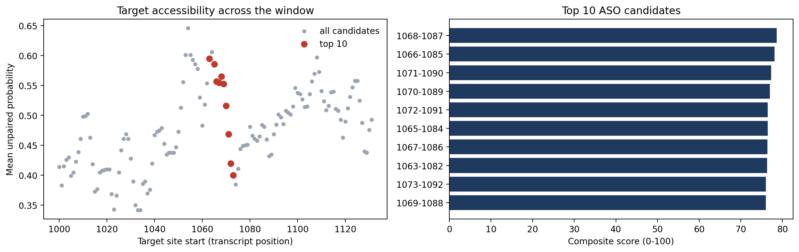

# ASO-design
# ASO Design and Ranking Demo

A Python notebook that tiles antisense oligonucleotide (ASO) candidates across a region of a
public NCBI transcript and ranks them by target-site accessibility, predicted hybridisation
energy, ASO self-structure and simple sequence flags.

Built independently on public data only, with AI assistance; I reviewed and tested the results.

## What it does
1. Downloads a public transcript from NCBI ([NM_004006.3]).
2. Tiles 20-nt candidates across [region] and folds the surrounding sequence with ViennaRNA.
3. Scores each candidate (accessibility 40, hybrid strength 25, GC content 20, self-structure 15).
4. Outputs a ranked table and plots.

## Results
Top 3 candidates: [1068-1087,1066-1085,1071-1090]

## Limitations
- ViennaRNA uses RNA energy parameters as a proxy for DNA/RNA hybrids.
- Chemistry (gapmer, 2'-MOE, PMO) and splicing mechanisms are not modelled.
- These are computationally ranked candidates, not validated drugs. Activity needs experimental testing.

## How to run
Open the notebook in Google Colab and run all cells.
